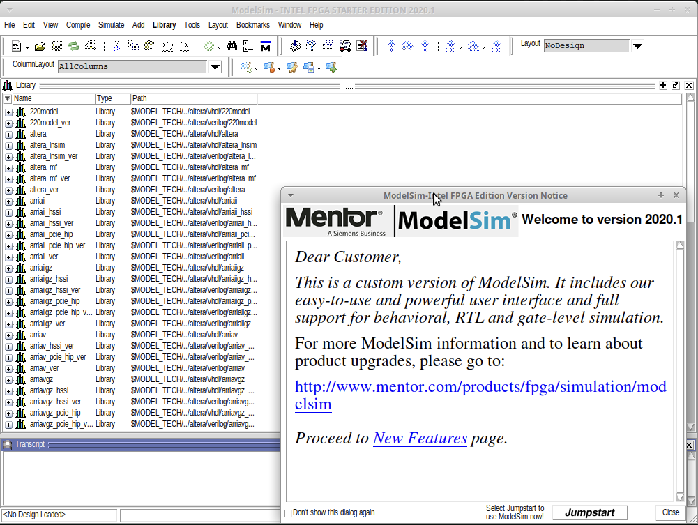

### Step 3: Run ModelSim

Once installed, launch ModelSim from its install directory.

---

**1. Launch ModelSim GUI:**

Open a terminal and run:

```bash
cd ~/intelFPGA_std/modelsim_ase/bin
./vsim
```

This starts the full GUI version of ModelSim. It should show the main simulation window open.



---

**2. Launch in Console Mode (Faster for VMs):**

To run ModelSim in command-line mode (useful for scripting or low-resource systems):

```bash
./vsim -c
```

This allows to load designs, run simulations, and print results in the terminal.

---

**3. Add to PATH (Optional):**

To avoid typing the full path every time, optionally add ModelSim to the shell PATH:

```bash
echo 'export PATH="$HOME/intelFPGA_std/bin:$PATH"' >> ~/.bashrc
source ~/.bashrc
```

Now it can just be run using:

```bash
vsim
```

or

```bash
vsim -c
```

from anywhere in the terminal.

---

## Troubleshooting notes:

- Selected **option-1** when prompted during modelsim installation.
- Gave the installation path as: **~/intelFPGA_std/** it created **modelsim_ae** by itself inside it.
- During several installation and deletes, did the following:
  - The original **bin/vsim** pointed to a broken launcher script (vco), which failed to start.
    The following `ln -s` command replaced it with a direct link to the actual working simulator binary **linux/vsim**
    
    ```bash
    ln -s ~/intelFPGA_std/modelsim_ae/linux/vsim ~/intelFPGA_std/modelsim_ae/bin/vsim`
    ```
    
  - Analyzed all the shared libraries that an executable (binary file) needs to run, using list dynamic dependencies.
    
    ```bash
    ldd ~/intelFPGA_std/modelsim_ae/linux/vsim`
    ```
    
  - Ubuntu is 64-bit by default and doesn't install 32-bit libraries unless explicitly told.
    Ensure the installation of 32-bit (i386) packages.
    
    ```bash
    sudo dpkg --add-architecture i386
    sudo apt update
    ```
    
  - Install the missing dependencies ModelSim requires. For example:
    ```bash
    sudo apt install libc6:i386 libx11-6:i386 libxft2:i386 libxext6:i386 libxtst6:i386 libglu1-mesa:i386 -y
    ```
    
✅ ModelSim is now ready to simulate Verilog designs!
    


