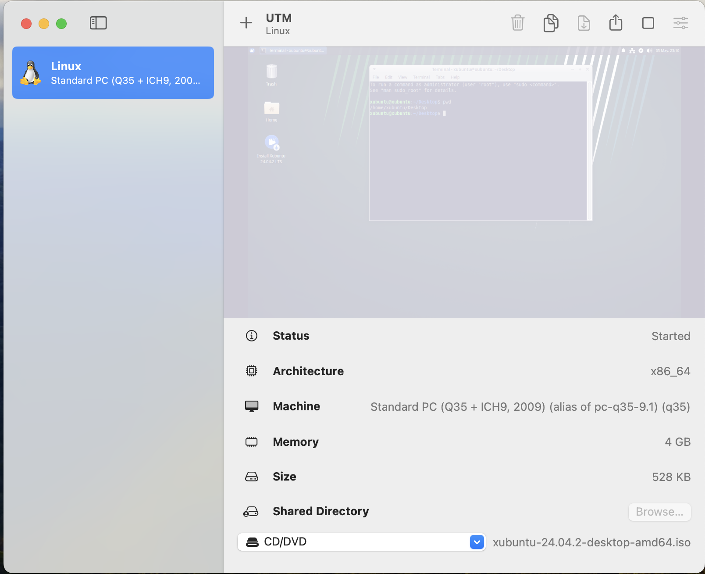
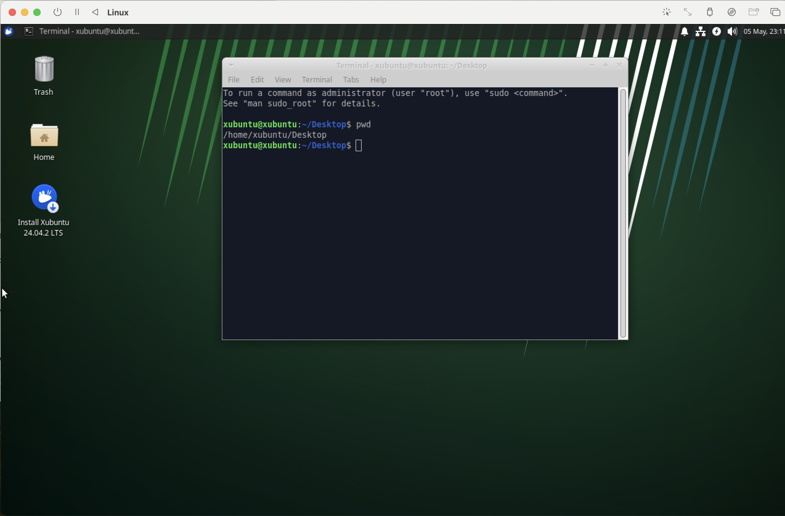
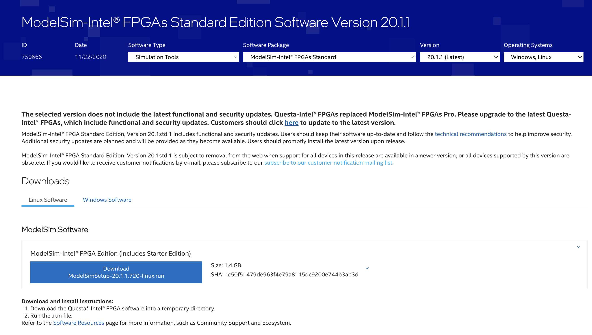

# Verilog Simulation Setup with ModelSim on Xubuntu
A Verilog simulation environment using ModelSim Intel FPGA Edition inside a Xubuntu virtual machine, built and run via UTM on macOS.

## ModelSim on Apple Silicon via Xubuntu VM

### Overview
- A clean and portable way to run ModelSim on macOS using a Xubuntu virtual machine.  
- Provides an environment to write, test, and simulate basic Verilog programs without OS compatibility issues.  
- Keeps all simulation tasks fully contained within the VM, isolating them from the host system.

### Motivation
- ModelSim is a widely used HDL simulator, but it is not natively supported on macOS.  
- This project solves that by running ModelSim inside a Linux VM with full GUI and functional support.  
- Enables a consistent Verilog simulation workflow on macOS without relying on unofficial tools or workarounds.

### System Configuration
- **Host OS**: macOS (Apple Silicon)  
- **Virtualization Tool**: [UTM](https://mac.getutm.app/)  
- **Guest OS**: [Xubuntu 20.04 LTS or later](https://xubuntu.org/download) (select a mirror in a location close to you.)
- **VM Specs**: 64 GB virtual disk, 4–8 GB RAM  
- **Simulator**: [ModelSim Intel FPGA Edition (Lite)](https://fpgasoftware.intel.com/)


### Setup Steps
1. Download the Xubuntu ISO from https://xubuntu.org/download
   
   
2. Create a new VM in UTM:
   - Allocate 64 GB disk, 4–8 GB RAM
   - Install Xubuntu inside the VM
   
   
3. Download ModelSim from: https://fpgasoftware.intel.com/
   
   
4. Inside the VM, install ModelSim.
   
   
5. Verify installation by launching ModelSim with `vsim` inside the VM.
   - The GUI should open showing the console and waveform viewer without errors.
   

## Installation Steps

Follow these instructions to set up **ModelSim Intel FPGA Edition** inside your Xubuntu VM.

---

### Step 1: Update System and Install Dependencies

Before installing ModelSim, update the package manager and install essential development libraries to ensure compatibility.

---

**1. Update and Upgrade System Packages:**

Open a terminal and run:

```bash
sudo apt update && sudo apt upgrade -y
```

This ensures your package lists and system software are current.

---

**2. Install Required Dependencies:**

ModelSim requires several runtime libraries and developer tools to run smoothly on Linux. Install them with:

```bash
sudo apt install build-essential libxft2 libxext6 libx11-dev libxtst6 libglu1-mesa -y
```

These libraries support GUI rendering, simulation timing, and system calls ModelSim depends on.

> 📝 Note: If you encounter a `dpkg` error, see the “Fixing dpkg error” section.

---

### Optional Fix-1: `dpkg` Error After Fresh Xubuntu Install

If you see:

```
E: Sub-process /usr/bin/dpkg returned an error code (2)
```

Follow these steps to fix it:

**1. Edit the source list:**
   ```bash
   sudo nano /etc/apt/sources.list
   ```

**2. Comment out the line starting with:** `deb cdrom:[...]` by adding a `#`

**3. Save and exit:** (`Ctrl + O`, Enter, then `Ctrl + X`)

**4. Run:**
   ```bash
   sudo dpkg --configure -a
   sudo apt clean
   sudo apt update
   sudo apt upgrade -y
   ```
---

### Optional Fix-2: Broken Install or `dpkg` Errors in UTM VM

In some UTM VM setups, you might encounter errors like:

```
E: Sub-process /usr/bin/dpkg returned an error code (1)
dpkg-deb: error: paste subprocess was killed by signal (Broken pipe)
Stale file handle
```

These are often caused by:
- Interrupted package installs
- `cdrom` source leftover in `/etc/apt/sources.list`
- Virtual disk sync issues (especially after suspend/resume)

Follow these steps to fix it:

**1. Reboot your Xubuntu VM** to clear stale file references:
   ```bash
   sudo reboot
   ```

**2. After reboot, open terminal and run:**

   ```bash
   sudo dpkg --configure -a
   sudo apt --fix-broken install
   ```

**3. Then continue with updates and ModelSim dependency install:**

   ```bash
   sudo apt update && sudo apt upgrade -y
   sudo apt install build-essential libxft2 libxext6 libx11-dev libxtst6 libglu1-mesa -y
   ```

If the problem continues, check which package failed with:
It means: “Give me all packages where the 3rd character (error state) is r” → these are reinstall-required or broken.

```bash
dpkg -l | grep ^..r
```

Then remove and reinstall that package manually if needed.
If it returns nothing, repeat (**3.**) above. 

**Important** There could be memory issue! 

This could me mistakenly done in the Live session, not the real installed Xubuntu !!!

Confirm:
```bash
df -h
```

---

### Step 2: Download and Install ModelSim

**1. Download the Installer:**

From within your **Xubuntu VM**, open Firefox and go to:

[https://fpgasoftware.intel.com](https://fpgasoftware.intel.com)

Then:

- Select **ModelSim – Intel FPGA Edition (Linux)**
- Choose the latest **Lite** or **Standard** version (Lite is free for non-commercial use)
- Save the `.run` file to your `Downloads` folder  
  (e.g., `ModelSimSetup-<version>.run`)

> ℹ️ You may need to register or sign in with an Intel account

---

**2. Make the Installer Executable:**

Open a terminal and run:

```bash
cd ~/Downloads
chmod +x ModelSimSetup-*.run
```

Use `Tab` to autocomplete the filename if needed.

---

**3. Run the Installer in Text Mode:**

```bash
./ModelSimSetup-*.run --mode text
```

This avoids the GUI installer (which can be slow in UTM) and provides a simple terminal-based flow.

---

**4. Choose the Install Directory:**

When prompted, install to:

```bash
~/intelFPGA_lite/modelsim_ase/
```

If the folder doesn’t exist, the installer will create it.

---

**5. Confirm Installation Success:**

You should see a message like:

```
Installation completed successfully.
```

---

### Step 3: Run ModelSim

Once installed, you can launch ModelSim from its install directory.

---

**1. Launch ModelSim GUI:**

Open a terminal and run:

```bash
cd ~/intelFPGA_lite/modelsim_ase/bin
./vsim
```

This starts the full GUI version of ModelSim. You should see the main simulation window open.

---

**2. Launch in Console Mode (Faster for VMs):**

To run ModelSim in command-line mode (useful for scripting or low-resource systems):

```bash
./vsim -c
```

This allows you to load designs, run simulations, and print results in the terminal.

---

**3. Add to PATH (Optional):**

To avoid typing the full path every time, you can add ModelSim to your shell PATH:

```bash
echo 'export PATH="$HOME/intelFPGA_lite/modelsim_ase/bin:$PATH"' >> ~/.bashrc
source ~/.bashrc
```

Now you can just run:

```bash
vsim
```

or

```bash
vsim -c
```

from anywhere in the terminal.

---

✅ ModelSim is now ready to simulate Verilog designs!


## Note: 

### Copy-Paste Between macOS and Xubuntu in UTM

If you're running Xubuntu in UTM on macOS:

- **Copy (from macOS)**: `Cmd + C`
- **Paste (into VM Terminal)**:  
  Inside Xubuntu Terminal, press:
  ```
  Ctrl + Shift + V
  ```
