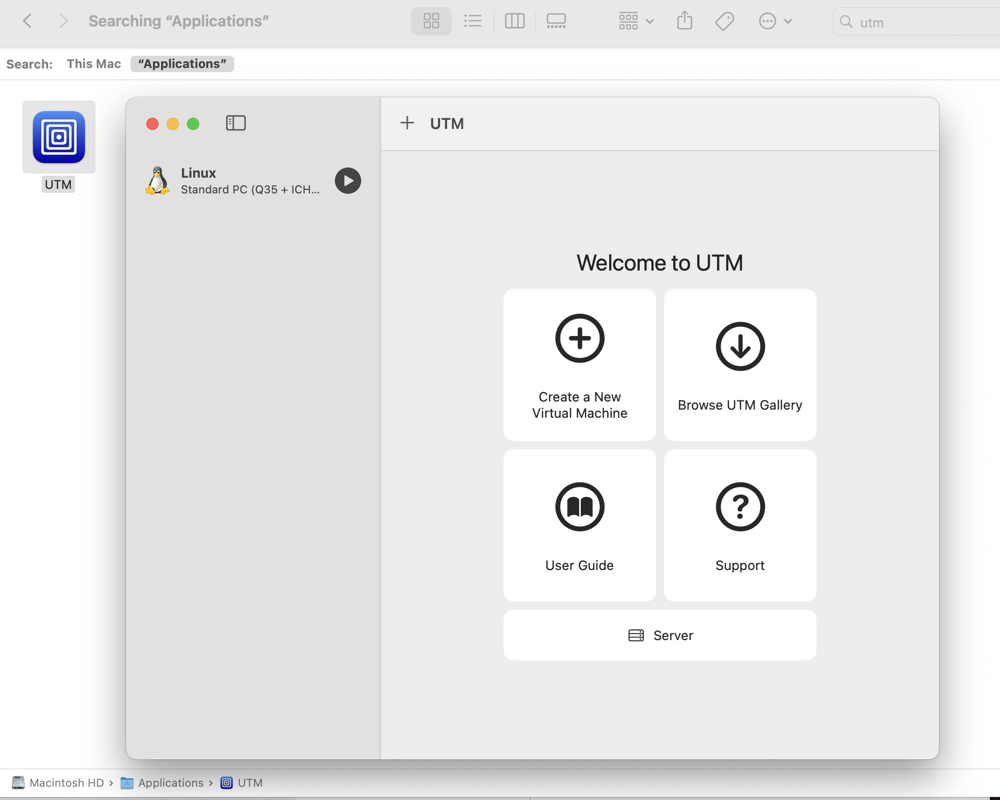
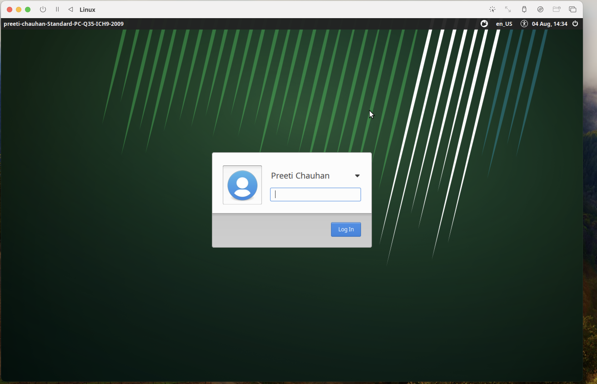
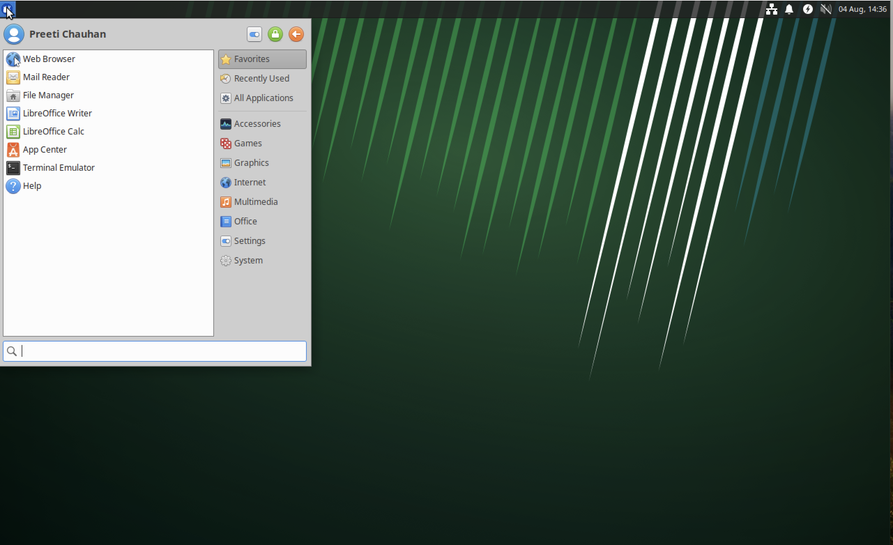
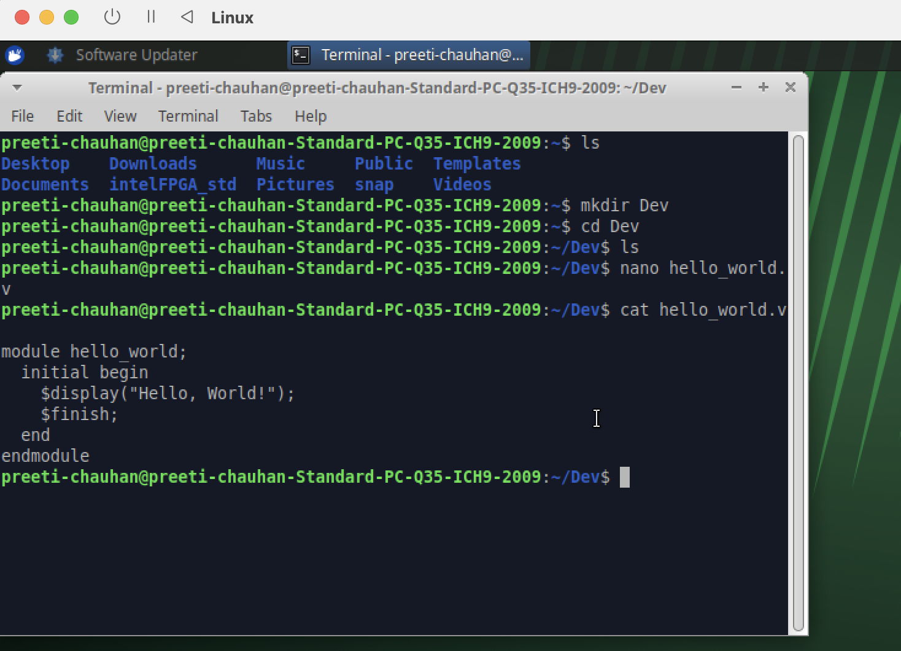
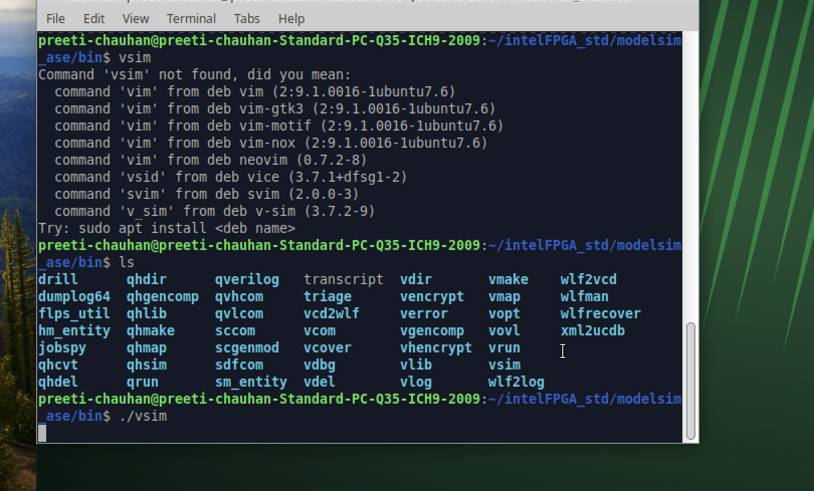
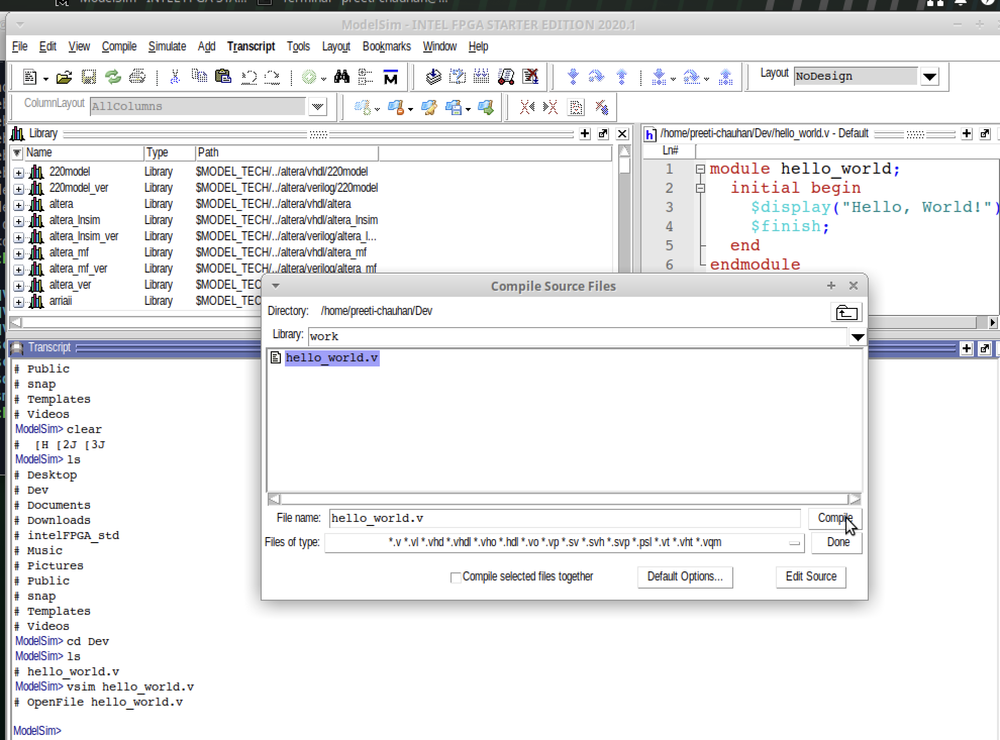
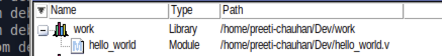
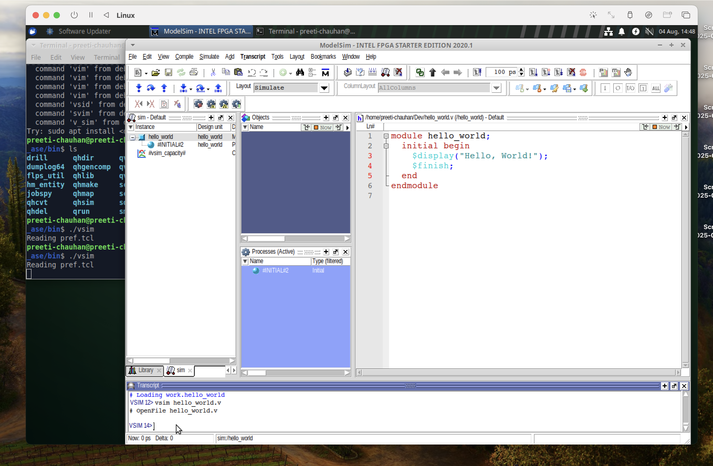
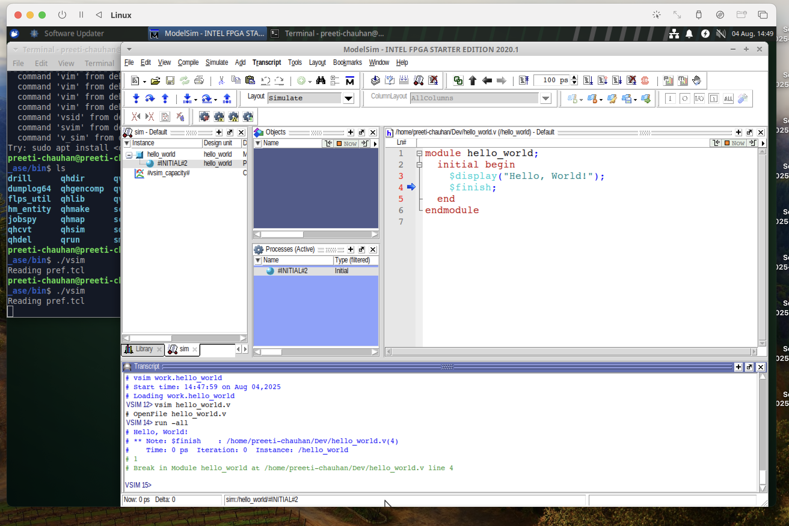

# Verilog Hello World

This is a simple Verilog example that prints "Hello, World!" during simulation.

## Running with ModelSim

1. Create a new ModelSim project.
2. Add `hello_world.v` to the project.
3. Compile the code.
4. Run the simulation:

```sh
vsim hello_world
run -all
```

## Recall: Verify Running with ModelSim
(in virtual machine)











